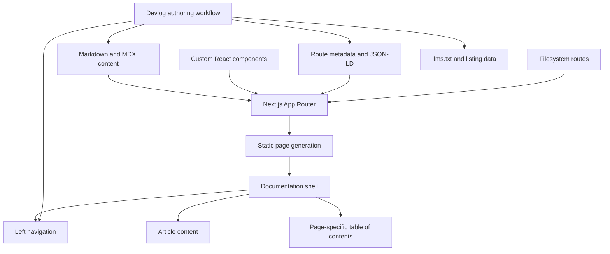

<div align="center">

# `GET /taylor`

### A technical portfolio disguised as API documentation.

*Because a normal portfolio template was boring.*

[Visit the portfolio](https://taylormcneil.dev) · [Technical musings on building products](https://taylormcneil.dev/aampersand) 

</div>


## What is this?

`docs-as-portfolio` is my technical portfolio, built to look and behave like a developer documentation site. It contains tutorials, technical guides, case studies, software projects, architecture notes, and an increasingly suspicious number of devlogs about building [aampersand](https://www.aampersand.com).

It is part portfolio, part publishing system, part documentation experiment.

```http
GET /quickstart
200 OK

{
  "name": "Taylor",
  "work": [
    "developer documentation",
    "software engineering",
    "developer experience",
    "products for writers"
  ],
  "status": "probably building something"
}
```


## The stack

| Layer | Technology | What it does |
|---|---|---|
| Framework | Next.js App Router | Routing, static generation, layouts, metadata, and deployment |
| Language | TypeScript | Keeps the site predictable enough to survive my ideas |
| Content | MDX | Lets Markdown and React components coexist in the same article |
| UI | React | Powers interactive diagrams, games, callouts, and custom article elements |
| Styling | Tailwind CSS | Handles layout, themes, and the documentation-inspired design system |
| Syntax highlighting | highlight.js | Makes code examples look like code examples |
| Diagrams | Mermaid and custom components | Explains systems that should not be trusted to prose alone |
| Deployment | Vercel | Turns commits into websites |
| Search metadata | JSON-LD, sitemap, Open Graph, `llms.txt` | Helps humans, search engines, and robots find their way around |

The site uses the official `@next/mdx` integration instead of a larger documentation framework such as Docusaurus or Nextra. This was deliberate. I wanted enough freedom for individual pages to misbehave. :)

## Architecture

At a high level, the site works like this:



### The filesystem is the content layer

There is no external CMS and no content database.

Each major page lives directly inside the Next.js route structure. For example:

```text
src/app/
├── quickstart/
│   └── page.mdx
├── guides/
│   └── hmac-authentication/
│       └── page.mdx
├── case-studies/
│   └── stellar-api-docs/
│       └── page.mdx
└── aampersand/
    ├── page.tsx
    ├── a-sirens-song/
    │   ├── layout.tsx
    │   ├── opengraph-image.png
    │   └── page.mdx
    └── a-seed-of-intention/
        ├── layout.tsx
        ├── opengraph-image.png
        └── page.mdx
```

The folder name becomes the URL. The MDX file becomes the page. Git becomes the publishing workflow.

## MDX, or: Markdown that escaped containment

The articles are written in MDX, which means they can contain ordinary Markdown:

```md
## A perfectly responsible heading

Here is a normal paragraph.
```

And then suddenly contain a React component:

```mdx
<Callout type="warning">
  This architecture decision has consequences.
</Callout>
```

Or an interactive diagram:

```mdx
<StoryGraph
  scenes={scenes}
  plotlines={plotlines}
  unresolvedProblems={moreThanExpected}
/>
```

The MDX compiler turns the entire article into a React component at build time.

This allows every page to remain readable as prose while still supporting custom experiences that would be impossible inside an ordinary Markdown renderer.

### Shared article components

The site includes a growing collection of components designed specifically for technical storytelling:

- `Callout`
- `CodeBlock`
- `CodeTabs`
- [`MySpaceLayout`](https://taylormcneil.dev/aampersand/a-broken-astrolabe#furniture-and-floors)
- [`StoryGraph`](https://taylormcneil.dev/aampersand/oily-bodies-in-karpathos#combinatorics-in-the-sun)
- `Mermaid`
- [`TicTacToeGame`](https://taylormcneil.dev/tutorials/java-game-dev#try-it-yourself)
- and several other components that began with the phrase, “Wouldn't it be funny if...”

Regular Markdown elements are also overridden with custom styles and behavior. Headings receive anchors, code blocks receive syntax highlighting and copy controls, and tables are styled to match the larger documentation system.


## The aampersand devlogs

The most elaborate section of the portfolio is the [aampersand devlogs](https://taylormcneil.dev/aampersand). Each entry documents a month of building aampersand, a creative writing tool designed to connect every thread in a story.

The devlogs combine:

- product decisions
- software architecture
- interface design
- database modeling
- user research
- performance work
- mistakes
- revisions
- mythology
- islands
- swords
- astrolabes
- and the occasional technological crisis disguised as a literary metaphor

Every devlog is its own static MDX route with:

- dedicated metadata
- a custom Open Graph image
- structured JSON-LD
- a table of contents
- bespoke diagrams or interactive components
- a listing entry on the devlog index
- an entry in `llms.txt`

This gives each article complete freedom, but it also creates a small amount of bookkeeping. By “small amount,” I mean “enough that I automated it.”

## The `/devlog` authoring workflow

A custom authoring workflow scaffolds each new devlog. It takes freeform prose and handles the repetitive parts of publication:

```text
Draft prose
    │
    ▼
/devlog workflow
    │
    ├── creates the route folder
    ├── creates page metadata
    ├── creates JSON-LD
    ├── converts author notes into MDX components
    ├── registers the article in navigation
    ├── updates the journal listing
    ├── updates llms.txt
    └── attaches the social preview image
```

Authoring hints can be embedded directly in a draft:

```text
[callout: explain why this broke]

[diagram: show the replay queue]

[figure: include the interface screenshot]

[please make this less embarrassing]
```

The workflow converts those instructions into the appropriate MDX and React components. The final result is still ordinary source code. There is no proprietary content format and no external publishing platform.

## Static by default

The portfolio is statically generated. There is no runtime content API and no request-time database query. During `next build`, each page is compiled into HTML and prepared for deployment.

That means:

- pages load quickly
- content remains available without a CMS
- each article can be versioned in Git
- deployments are reproducible
- hosting is delightfully uneventful

The sitemap is generated from the route structure, while structured metadata and social previews are configured per article.

The site also includes a “Copy as Markdown” feature. During the build, it reads the original MDX source so visitors can copy the article as clean Markdown for notes, AI conversations, or small acts of documentation theft.

Respectful documentation theft.

## Why not use Docusaurus, Nextra, or a CMS?

Those are excellent tools. This project is not an argument against them.

I built the system directly because I wanted:

- one unified Next.js application
- complete control over the visual language
- page-specific interaction patterns
- custom React components inside articles
- freedom to break the standard documentation layout
- no dependency on a hosted content platform
- a deeper understanding of how documentation systems work underneath their themes

The tradeoff is that some features normally generated by a framework are curated manually or through my own automation.

This project therefore sits somewhere between:

```text
documentation framework
        +
static publishing system
        +
React application
        +
personal website
        +
long-running practical joke
```

## Selected routes

| Route | What lives there |
|---|---|
| [`/quickstart`](https://taylormcneil.dev/quickstart) | A guided introduction to me, because apparently I am an API |
| [`/guides/hmac-authentication`](https://taylormcneil.dev/guides/hmac-authentication) | An enterprise authentication guide with architecture diagrams and implementation examples |
| [`/case-studies/stellar-api-docs`](https://taylormcneil.dev/case-studies/stellar-api-docs) | A case study on API documentation and OpenAPI work for Stellar |
| [`/tutorials/mongodb-tanstack`](https://taylormcneil.dev/tutorials/mongodb-tanstack) | A full-stack technical tutorial |
| [`/side-projects/the-longview`](https://taylormcneil.dev/side-projects/the-longview) | A local-first visual planning application |
| [`/aampersand`](https://taylormcneil.dev/aampersand) | The devlog for aampersand |
| [`/changelog`](https://taylormcneil.dev/changelog) | A running record of changes, experiments, and evidence |

## Current status

The portfolio is actively maintained.

New technical work, devlog entries, diagrams, and components are added as the underlying projects evolve. Some people update their portfolio when they begin job hunting.

*I accidentally built a publishing platform.*
